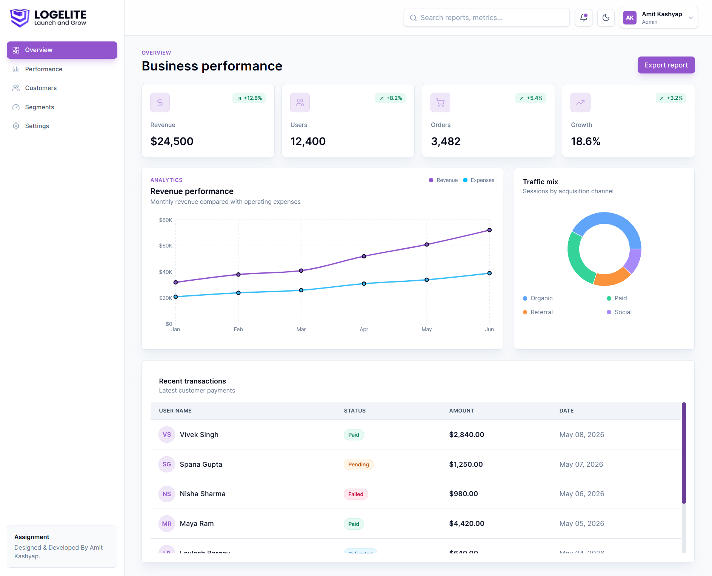
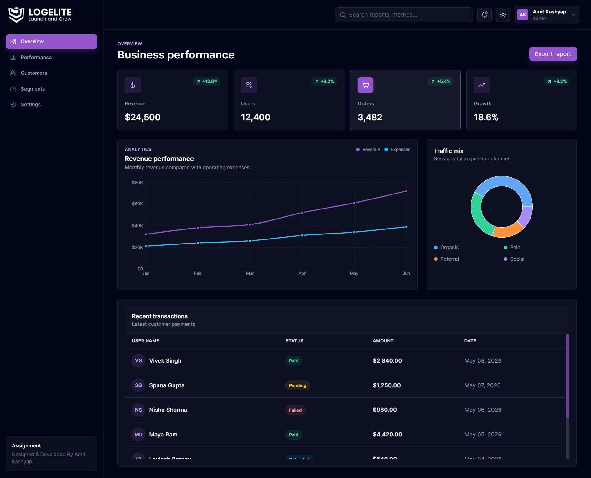
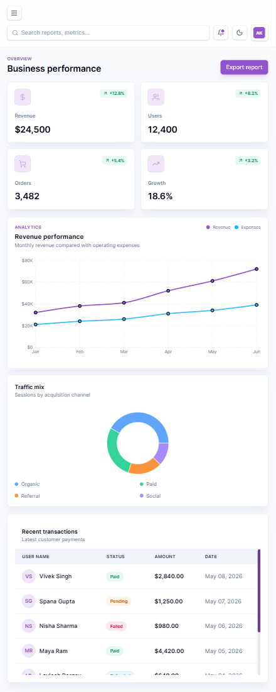
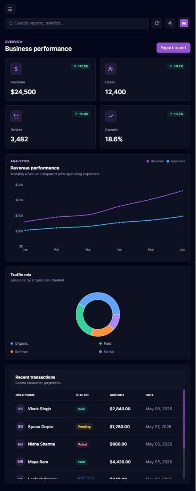

# React Analytics Dashboard

A modern, responsive analytics dashboard built with React, Vite, Tailwind CSS, Framer Motion, and Recharts. The project is structured as a logelite frontend developer assignment focused on reusable components, clean dashboard layout, dark SaaS styling, responsive behavior, and polished UI animations.

## Project Overview

This dashboard presents key business metrics, revenue trends, traffic distribution, recent transactions, and activity updates in a professional analytics interface. It is designed as a maintainable React frontend with separated layout, chart, data, utility, and dashboard feature components.

## Tech Stack

- React
- Vite
- JavaScript
- Tailwind CSS
- Framer Motion
- Recharts
- Lucide React icons
- ESLint

## Features

- Dark modern SaaS dashboard UI
- Responsive sidebar with mobile slide-out drawer
- Header with search, notification icon, and user profile section
- Reusable analytics stat cards
- Revenue, users, orders, and growth metrics
- Responsive Recharts line chart
- Traffic distribution chart
- Transaction table with status badges
- Recent activity panel
- Static analytics data separated from UI components
- Clean component-based architecture

## Animation Features

- Page fade-in animation
- Section scroll reveal animation
- Stat card hover scale and lift effects
- Mobile sidebar slide animation
- Smooth chart appearance animation
- Transaction row reveal animation
- Consistent easing for a professional dashboard feel

## Responsive Support

The dashboard is optimized for:

- Mobile screens with compact spacing and collapsible sidebar
- Tablet screens with adaptive grids and balanced spacing
- Desktop screens with fixed sidebar and multi-column dashboard layout

Responsive behavior uses Tailwind CSS breakpoint utilities, flexible grid layouts, `min-w-0` overflow protection, and horizontal scroll handling for the transaction table.

## Folder Structure

```text
src/
  assets/
    images/
  components/
    charts/
      ChannelChart.jsx
      RevenueChart.jsx
    common/
      ui/
        Card.jsx
        SectionHeader.jsx
    dashboard/
      ActivityList.jsx
      MetricCard.jsx
      TransactionTable.jsx
    layout/
      DashboardLayout.jsx
      Header.jsx
      Sidebar.jsx
  data/
    analyticsData.js
    sidebarMenu.js
  hooks/
    useDashboardData.js
  pages/
    Overview.jsx
  styles/
    index.css
  utils/
    formatters.js
  App.jsx
  main.jsx
```

## Folder Purpose

- `components/layout`: App shell components such as sidebar, header, and main dashboard layout.
- `components/dashboard`: Dashboard-specific UI sections such as stat cards, activity list, and transaction table.
- `components/charts`: Reusable chart components built with Recharts.
- `components/common/ui`: Shared UI primitives used across the dashboard.
- `data`: Static dashboard data and navigation menu data.
- `hooks`: Reusable hooks for composing dashboard data.
- `pages`: Page-level screens that compose layout and feature components.
- `styles`: Global Tailwind and base styles.
- `utils`: Shared helper functions such as formatters.

## Setup Instructions

Install dependencies:

```bash
npm install
```

Start the development server:

```bash
npm run dev
```

Build for production:

```bash
npm run build
```

Run linting:

```bash
npm run lint
```

Preview the production build:

```bash
npm run preview
```

## Design Inspiration

The visual direction is inspired by modern SaaS analytics tools with:

- Dark dashboard surfaces
- Subtle glass-like cards
- Purple brand accent color
- Clean typography
- Compact data-focused layouts
- Smooth but restrained motion
- Desktop-first analytics density with mobile-friendly behavior

## Time Spent

Approximate time spent: **7-9 hours**

This includes project structure planning, layout implementation, responsive refinement, reusable components, chart/table integration, Framer Motion animations, and final polish.

## Dashboard Light Preview



## Dashboard Dark Preview



## Dashboard Tablet Light and Drak Preview

<p align="center">

  
  &nbsp;&nbsp;
  

</p>
